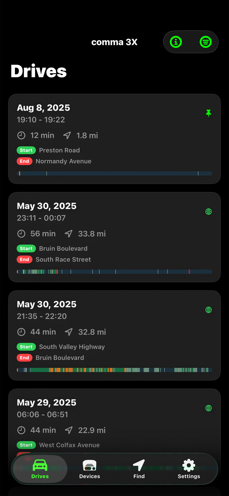
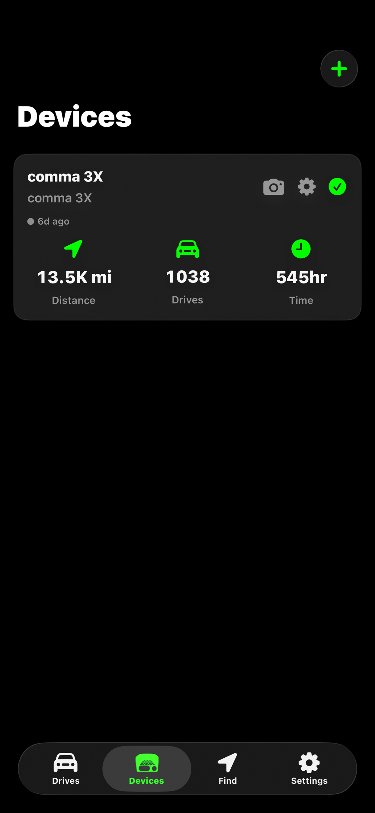
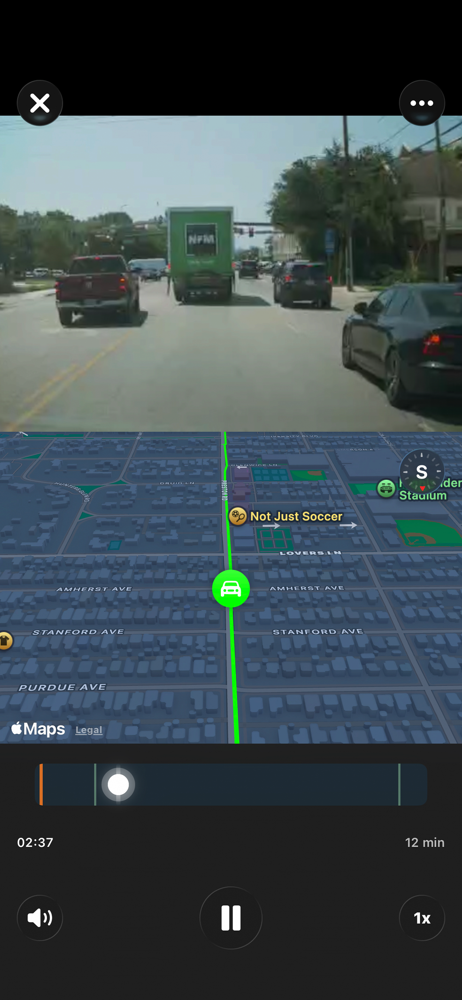

<p align="center">
  
</p>

<p align="center">
  <strong>A native iOS application for managing comma.ai devices and viewing drives</strong>
</p>

<p align="center">
  <em>Unofficial third-party client. Not affiliated with, endorsed by, or sponsored by comma.ai.</em>
</p>

<p align="center">
  <a href="https://developer.apple.com/ios/"></a>
  <a href="https://swift.org"></a>
  <a href="https://developer.apple.com/xcode/swiftui/"></a>
  <a href="LICENSE"></a>
</p>

## Screenshots

<p align="center">
  
  
  
</p>

<p align="center">
  <em>Left: Drives page with timelines | Center: Device management | Right: Drive viewer with video and map</em>
</p>

## Overview

Comma Connect is a modern iOS application that enables users to manage their comma.ai devices, view driving data, watch route recordings, and monitor their vehicles. Built entirely with SwiftUI and modern Swift concurrency, the app provides a native, performant experience for comma.ai users.

### Key Features

- **Multi-Provider Authentication**: OAuth support for Google, Apple, and GitHub
- **Device Management**: Pair, manage, and monitor comma.ai devices (comma 3X, comma four, etc.)
- **Drive Timeline**: View driving history with date range filtering
- **Video Playback**: Stream videos of drives
- **Route Visualization**: View your driving routes on maps
- **Real-time Telemetry**: Live device status, vehicle battery status, and location tracking
- **File Management**: Upload and download driving data
- **Settings & Preferences**: Customizable units, haptics, and map orientation

---

## Table of Contents

- [Screenshots](#screenshots)
- [Architecture](#architecture)
- [Requirements](#requirements)
- [Installation](#installation)
- [Features](#features)
- [Technology Stack](#technology-stack)
- [Security](#security)
- [Development](#development)
- [Testing](#testing)
- [Contributing](#contributing)
- [License](#license)
- [Acknowledgments](#acknowledgments)

---

## Architecture

### Design Pattern

The app uses a **hybrid MVVM + Observable State Management** pattern with modern SwiftUI practices:

```
Views (SwiftUI)
├── Auth
├── Dashboard
└── Device Viewer
        │
        │ @Environment
        ↓
AppState (@Observable)
├── Authentication state
├── Device management
├── Route loading & caching
└── User preferences
        │
        │ Protocol-based DI
        ↓
Services Layer
├── APIClient (Protocol)
│   └── ProductionAPIClient (implements protocol)
├── AuthService
├── OAuthService
├── LocationService
└── FileManagementService
        │
        ↓
Data Models
├── Device (SwiftData)
├── Route (SwiftData)
└── DriveEvent, UserProfile, etc.
```

### Key Architectural Decisions

1. **Observable State**: Central `AppState` singleton using `@Observable` macro (iOS 17+)
2. **Protocol Abstraction**: `APIClient` protocol with production implementation
3. **Environment Injection**: Views access shared state via `@Environment`
4. **Service Layer**: Business logic isolated from UI

---

## Requirements

- **iOS**: 17.0+ (prefer iOS 26 for Liquid Glass effect)
- **Xcode**: 15.0+
- **Swift**: 5.0+
- **Device**: iPhone

---

## Installation

### 1. Clone the Repository

```bash
git clone https://github.com/Willebrew/connect-ios.git
cd connect-ios
```

### 2. Open in Xcode

```bash
open connect-ios.xcodeproj
```

### 3. Configure Signing

1. Select the project in Xcode
2. Go to **Signing & Capabilities**
3. Select your development team
4. Ensure bundle identifier is unique

### 4. Build and Run

Press `Cmd + R` or click the **Run** button in Xcode

---

## Features

### Authentication

- **Multi-provider OAuth**: Google, Apple, GitHub
- **Secure token storage**: iOS Keychain integration
- **Automatic token refresh**: Handles expired tokens
- **Demo account**: Pre-configured demo JWT token for testing (valid until 2062)

### Device Management

- **Device pairing**: QR code scanner for quick setup
- **Device list**: View all connected devices
- **Device status**: Real-time online/offline status
- **Device aliasing**: Rename devices for easy identification
- **Device unpair**: Remove devices from account

### Drive Viewing

- **Timeline view**: Browse driving history chronologically
- **Date range filters**: 7 days, 30 days, all time
- **Pagination**: Load more drives as you scroll
- **Drive statistics**: Duration, distance, start/end times
- **Skeleton loaders**: Smooth loading states

### Drive Viewer

- **Video playback**: Stream HLS videos at multiple speeds
- **Interactive map**: See your route on an interactive map
- **Event timeline**: View engagement, alerts, overrides, bookmarks
- **Location info**: Reverse geocoded start/end addresses using Mapbox
- **Route actions**: Make routes public or preserve them

### File Management

- **Upload queue**: Monitor file uploads
- **Upload control**: Control when files upload
- **File downloads**: Download driving data to device

### Settings

- **Units**: Miles or kilometers
- **Haptic feedback**: Toggle haptic responses
- **Map orientation**: Lock map to north
- **Profile**: View user info (email, username, ID)
- **Sign out**: Securely log out

---

## Technology Stack

### Language & Frameworks
- **Swift 5.0+**: Modern Swift with async/await
- **SwiftUI**: Declarative UI framework
- **SwiftData**: Native data persistence with `@Model`

### Networking
- **URLSession**: Native HTTP client
- **REST API**: comma.ai API integration
- **HLS Streaming**: Video playback via M3U8

### Authentication
- **AuthenticationServices**: Native OAuth via `ASWebAuthenticationSession`
- **WebKit**: Embedded web views for OAuth flows
- **Keychain**: Secure credential storage

### Storage
- **SwiftData**: Primary data persistence
- **UserDefaults**: Simple preferences
- **Keychain**: Secure token storage

### Real-time Communication
- **Athena Service**: JSON-RPC over HTTP
- **Device commands**: Snapshot capture, upload management

### Media & Maps
- **AVFoundation**: Video playback
- **MapKit**: Route visualization
- **Mapbox API**: Reverse geocoding

### Development Tools
- **OSLog**: Apple's unified logging system
- **Xcode Previews**: Rapid UI iteration

---

## Security

### Best Practices

**Secure Storage**
- JWT tokens stored in iOS Keychain
- No sensitive data in UserDefaults
- Automatic token cleanup on logout

**Token Management**
- JWT expiration validation before API calls
- Secure token redaction in logs

**OAuth Security**
- Redirect URI validation
- State parameter verification
- Custom URL scheme capture

**Privacy**
- Sensitive URL parameters redacted in logs
- Token prefix-only logging
- No private credentials in source code
- Includes public client identifiers and a shared demo token for the intended demo experience

**Network Security**
- HTTPS-only communication
- Certificate pinning (not currently implemented, recommended for production)
- Timeout handling
- TLS 1.2+ enforced by URLSession

---

## Development

### Running in Debug Mode

```bash
# Build for simulator
xcodebuild -scheme connect-ios -sdk iphonesimulator

# Build for device
xcodebuild -scheme connect-ios -sdk iphoneos
```

### Demo Mode

The app includes a pre-configured demo account for testing:

```swift
// Defined in AppConstants.swift
static let demoToken = "eyJhbGci..." // Valid until 2062
// Identity: 0decdcdcfdf241a60
```

**Features:**
- Real API calls to comma.ai backend
- Access to actual demo account devices and drives
- Same experience as using your own account (read-only)
- Shared demo account (same as comma.ai webapp)
- Perfect for testing the app without OAuth setup
- No expiration concerns (valid until 2062)

**Restrictions:**
- Cannot pair new devices (demo account is read-only)
- Cannot unpair devices (demo account is read-only)
- Cannot rename devices (demo account is read-only)
- Cannot make routes public or preserve routes (demo account is read-only)
- CAN view all drives, videos, and telemetry
- CAN test all viewing features

### Logging

The app uses structured logging with categories:

```swift
import os

// Available loggers
Logger.auth.debug("Authentication event")
Logger.api.info("API request")
Logger.ui.error("UI error")
Logger.data.debug("Data operation")
```

### Custom Extensions

```swift
// Color from hex
Color(hex: "#1A1A1A")

// Relative date formatting
date.timeAgo       // "2 hours ago"
date.shortTimeAgo  // "2h ago"
date.dayMonthYear  // "Nov 11, 2025"
```

---

## Testing

### SwiftUI Previews

All views include SwiftUI previews for rapid development:

```swift
#Preview {
    DashboardView()
        .environment(AppState.shared)
}
```

### Demo Account

The included demo account provides:
- Real comma.ai devices and data
- Actual drive recordings with video
- Live telemetry and events
- Full feature testing without OAuth setup

---

## Performance

### Optimization Strategies

1. **Lazy Loading**: Routes loaded in batches of 8
2. **Preloading**: Drive data fetched before UI renders
3. **Parallel Fetching**: Task groups for concurrent API calls
4. **Caching**: Events, coordinates, locations cached in memory
5. **SwiftData Transient**: Non-persisted computed properties

### Memory Management

- Weak references for closures
- Automatic cleanup on view dismissal
- Image compression for thumbnails
- Efficient data structure management

---

## API Integration

### Supported Endpoints

**Authentication**
- `POST /v1/auth/oauth/authenticate` - OAuth token exchange
- `GET /v1/me` - User profile

**Devices**
- `GET /v1/me/devices/` - List devices
- `GET /v1/devices/:dongle_id` - Get single device
- `GET /v1.1/devices/:dongle_id/stats` - Device statistics
- `POST /v1/devices/` - Pair device (with pair_token)
- `POST /v1/devices/:dongle_id/unpair` - Unpair device
- `PATCH /v1/devices/:dongle_id/` - Update device (alias, etc.)
- `GET /v1/devices/:dongle_id/location` - Device location

**Routes**
- `GET /v1/devices/:dongle_id/routes_segments` - List drives with segments
- `GET /v1/devices/:dongle_id/routes?preserved=true` - Get preserved routes
- `GET /v1/routes/:route_id` - Route details
- `GET /v1/routes/:route_id/events` - Event timeline
- `GET /v1/routes/:route_id/coordinates` - GPS coordinates
- `PATCH /v1/route/:fullname/` - Update route (is_public, etc.)
- `POST /v1/route/:fullname/preserve` - Preserve route
- `DELETE /v1/route/:fullname/preserve` - Unpreserve route

**Athena (Real-time)**
- `POST /jsonrpc` - Device commands (snapshot, upload queue)

**Files**
- `GET /v1/devices/:dongle_id/upload_url` - Get upload URL
- File upload/download via presigned URLs

**Billing**
- `GET /v1/me/subscription` - Prime subscription status

---

## Data Models

### Device (Codable struct)

```swift
struct Device: Codable, Identifiable {
    var dongleId: String
    var alias: String
    var deviceType: String
    var isOwner: Bool
    var shared: Bool
    var serial: String?
    var imei: String?
    var createTime: Date
    var lastAthenaPing: Date?
    var networkMetered: Bool
    var openpilotVersion: String?
    var prime: Bool
    var fetchedAt: Date

    // Computed properties
    var isOnline: Bool // Based on lastAthenaPing within 2 minutes
    var displayName: String
    var deviceTypePretty: String
}
```

### Route (SwiftData)

```swift
@Model
class Route {
    var fullname: String  // "dongle_id|date|segment"
    var startTimeUtc: Date
    var endTimeUtc: Date
    var distance: Double
    var duration: TimeInterval

    // Transient (not persisted)
    var events: [DriveEvent]?
    var driveCoords: [Int: [Coordinate]]?
    var startLocation: String?
    var endLocation: String?
}
```

### Drive Event

```swift
struct DriveEvent {
    enum EventType {
        case engagement
        case alert(String)
        case userFlag
        case override
    }

    var type: EventType
    var startTime: TimeInterval
    var endTime: TimeInterval?
    var value: String?
}
```

### Other Models

**UserProfile** - User account information
```swift
struct UserProfile {
    var id: String
    var email: String?
    var username: String?
    var points: Int?
}
```

**DeviceStats** - Device statistics
```swift
struct DeviceStats {
    var all: DeviceStatDetail
    var week: DeviceStatDetail

    struct DeviceStatDetail {
        var routes: Int
        var distance: Double
        var minutes: Int
    }
}
```

**Coordinate** - GPS coordinate data
```swift
struct Coordinate: Codable {
    var lat: Double
    var lng: Double
    var bearing: Double?
    var speed: Double?
}
```

**Subscription** - Prime subscription info
```swift
struct Subscription {
    var trial: Bool
    var plan: String
    var validUntil: Date?
}
```

---

## Roadmap

### Planned Features
- [ ] Offline route viewing
- [ ] Push notifications for device alerts
- [ ] Comprehensive unit and UI test suite

### Known Issues
- Large route coordinate sets may cause memory pressure on older devices
- Video playback requires stable internet connection
- Date picker UI could be improved for custom date ranges

---

## Contributing

Contributions are welcome! Please follow these guidelines:

1. **Fork** the repository
2. **Create** a feature branch (`git checkout -b feature/amazing-feature`)
3. **Commit** your changes (`git commit -m 'Add amazing feature'`)
4. **Push** to the branch (`git push origin feature/amazing-feature`)
5. **Open** a Pull Request

### Code Style

- Follow Swift API Design Guidelines
- Write descriptive commit messages
- Add comments for complex logic
- Include previews for UI components

---

## License

The app source code is licensed under the MIT License - see the LICENSE file for details.

This repository also includes vendored third-party binary frameworks and brand assets that are distributed under their own licenses and terms. See [THIRD_PARTY_NOTICES.md](THIRD_PARTY_NOTICES.md) before redistributing binaries or publishing app builds.

---

## Acknowledgments

- **comma.ai** - For the amazing community and open source platform
- **Mapbox** - For geocoding services
- **Apple** - For SwiftUI and modern Swift frameworks
- **[Icons8](https://icons8.com)** - Apple and Google provider icons used in the sign-in flow
- **[FFmpegKit](https://github.com/Beeper/ffmpeg-kit)** (Beeper fork) - Video remuxing pipeline

---

## Support

For issues, questions, or feature requests:

- **Issues**: [GitHub Issues](https://github.com/Willebrew/connect-ios/issues)
- **comma.ai Discord**: [Join the community](https://discord.comma.ai)
